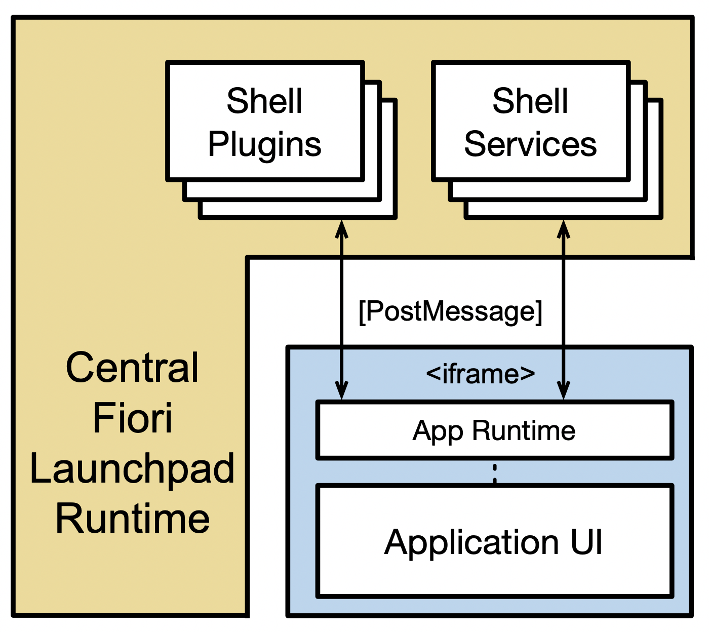

# cflp-appruntime

**WIP**

Generic JS API facade for Central Fiori Launchpad.
It could be used by any framework (Angular, React, Vue...) to integrate with cFLP.

TBD: is this library maintained as an open source or owned by Portal.

##### Table of Contents

- [Background](#background)
    - [Links](#links)
- [Install](#install)
- [Usage](#usage)
    - [React](#react)
    - [Angular](#angular)
- [API](#usage)
    - [Extensions](#extensions)
- [Development](#development)


## Background

SAP has a large and diverse product portfolio. It consists of own software developments, software from acquired companies, and from partners. These products are heterogeneous in many aspects, such as deployment models, technology stacks, and tooling. While this diversity is needed to provide a maximum of flexibility, speed, and competitiveness to SAP customers, it also poses integration challenges on various levels. The challenge of making application UIs from different products available in a central entry point will be addressed by a “Central Fiori Launchpad”, which is part of Portal Service on SAP Cloud Platform CF.

In order to achieve seamless integration between the isolated apps in runtime, two interfaces needs to be implemented: 

- URL Template to abstract URL cnostruction - e.g. business parameters, application URL, etc...
- **Application Runtime** - helps running isolated apps in `<iframe>` with FLP context like plugins or services
  - UI5 App Runtime is owned and maintained by cFLP, and it is not reuseable by other technologies

This library is a generic App Runtime, that can be adopted by any technology or product.
It gives an abstraction of the post message interface. The exported artefact is a plain JS/TS w/o runtime dependencies. 



### Links

- [Application Integration - High Level Design](https://wiki.wdf.sap.corp/wiki/display/unifiedshell/Application+Integration+-+High+Level+Design)
- [Application Integraion APIs](https://wiki.wdf.sap.corp/wiki/display/uxintegra/Application+Integration+APIs)
- [Post Message Spec](https://wiki.wdf.sap.corp/wiki/display/unifiedshell/Post+Message+Service)
- [Intent Based Navigation](https://wiki.wdf.sap.corp/wiki/display/uxintegra/Intent-based+navigation)
- [WIP - Appruntime API Implementation](https://wiki.wdf.sap.corp/wiki/x/X3yMhw)

## Install

Currently, directly from github (in future from SAP npm registry):

```bash
npm i cflp-appruntime@git://github.wdf.sap.corp/Portal-CF/cflp-appruntime.git
```

## Usage

Import the module, make sure to call `init()` once:

```js
import appRuntimeFacade from 'cflp-appruntime';

export default class MyApp extends App {
   componentDidMount() {
       // init app runtime
       appRuntimeFacade.init();
   }

   render() {
       // ...
   }
}
```

You can also load only parts of the library:

```js
import { init } from 'cflp-appruntime/base';
import { setShellTitle } from "cflp-appruntime/shell-bar";

export default class MyApp extends App {
   componentDidMount() {
       // init app runtime
       init();

       setShellTitle("My React App Title!!");
   }

   render() {
       ...
   }
}
```

### Configure Handlers

App Runtime provides an method for handlers configuration, such as app-life-cycle (stateful container) or session handler:

```js
import appRuntimeFacade from 'cflp-appruntime';

export default class MyApp extends App {

   componentDidMount() {
       appRuntimeFacade.init()
           .use({
               sessionHandler: { // sync session activity with cFLP
                  onExtend: () => { console.log("session extended!"); },
                  manageUserActivity: true
               }
           });
   }

   render() {
       // ...
   }
}
```


### React

See [React App Example](https://github.wdf.sap.corp/I303129/cflp-react-app)

...

### Angular

See [Angular App Example](https://github.wdf.sap.corp/I303129/cflp-angular-app)

```js
import { Component } from '@angular/core';
import appRuntime from "cflp-appruntime";

@Component({
  selector: 'app-root',
  templateUrl: './app.component.html',
  styleUrls: ['./app.component.css']
})
export class AppComponent {
  // ...

  constructor() {
    // init from main app component
    appRuntime.init();
  }

  async setTitle(title: string) {
    await appRuntime.setShellTitle(title);
  }
}
```

## API

...

### Extensions

...

## Development

Install:
```bash
npm i
```

Build:
```bash
npm run build
```

Tests:
```bash
npm run test
```

Release (master branch):
```bash
npm run release:patch
git push origin master
```
*Make sure to be updated with master
